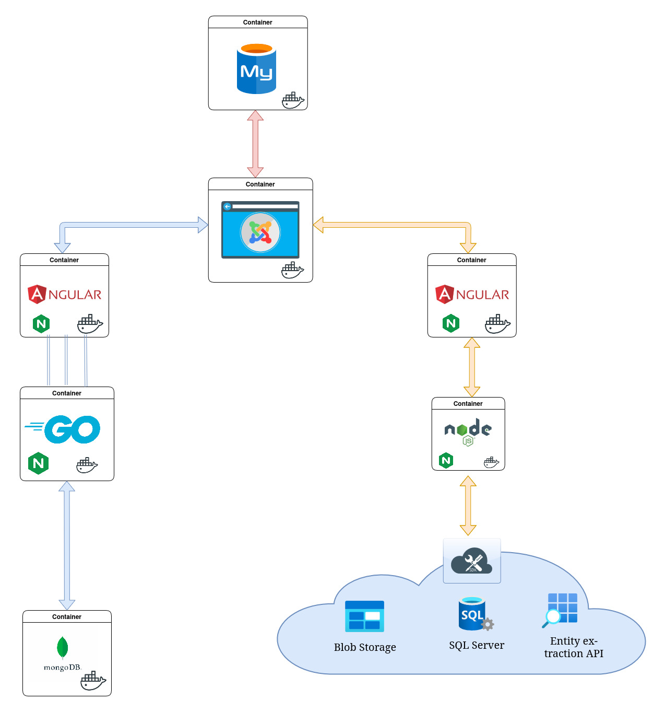

Web Platform with Chat & AI Entity Extraction
=============================================

A Kubernetes-based web platform that integrates a content management system with real-time chat capabilities and AI-powered entity extraction services.

Show Image

Project Overview
----------------




This project demonstrates a modern microservices architecture deployed on Kubernetes. It consists of three main components:

1.  **Content Management System (Joomla)** - A fully-featured CMS serving as the main website entry point
2.  **Real-time Chat Application** - Websocket-based chat service with message persistence
3.  **AI Entity Extraction Service** - Text analysis service leveraging Azure Cognitive Services

The platform is designed to be scalable, fault-tolerant, and easily manageable through Kubernetes orchestration.

Architecture
------------

### Content Management System

-   **Joomla CMS** (3 replicas) with custom configuration
-   **MySQL Database** for CMS data persistence
-   Exposes service on port 80

### Chat Application

-   **Backend**: Go-based WebSocket server (6 replicas) with Nginx
-   **Frontend**: Angular application (1 replica)
-   **Database**: MongoDB for message persistence
-   Exposes service on port 88 (backend) and 90 (frontend)

### AI Entity Extraction

-   **Backend**: Go API service with Azure integrations (1 replica)
-   **Frontend**: Angular application (1 replica)
-   Uses Azure Blob Storage for file uploads
-   Uses Azure SQL Database for metadata storage
-   Leverages Azure Cognitive Services for entity extraction
-   Exposes service on port 99 (backend) and 98 (frontend)

### Integration

Both applications are embedded within the Joomla CMS using iframes, providing a seamless user experience.

Technologies Used
-----------------

-   **Languages**: Go, TypeScript
-   **Frameworks**: Angular, Nginx
-   **Databases**: MongoDB, MySQL, Azure SQL
-   **Cloud Services**: Azure Cognitive Services, Azure Blob Storage
-   **Containerization**: Docker, Kubernetes
-   **CI/CD**: GitHub Actions

Deployment
----------

The entire platform is deployed on a Kubernetes cluster with automated setup through a series of YAML manifests:

```
kubernetes/
├── ai/
│   ├── backend/
│   │   ├── backend-configmap.yaml
│   │   ├── backend-deployment.yaml
│   │   └── backend-service.yaml
│   └── frontend/
│       ├── frontend-deployment.yaml
│       └── frontend-service.yaml
├── chat/
│   ├── backend/
│   │   ├── backend-configmap.yaml
│   │   ├── backend-deployment.yaml
│   │   └── backend-service.yaml
│   ├── db/
│   │   ├── mongodb-deployment.yaml
│   │   ├── mongodb-pvc.yaml
│   │   └── mongodb-service.yaml
│   └── frontend/
│       ├── frontend-deployment.yaml
│       └── frontend-service.yaml
└── cms/
    ├── joomla/
    │   ├── configmap-joomla.yaml
    │   ├── deployment-joomla.yaml
    │   └── service-joomla.yaml
    └── mysql/
        ├── deployment-mysql.yaml
        └── service-mysql.yaml
```

### Deployment Process

1.  The deployment uses a multi-stage Docker build for optimized container images
2.  Environment variables are managed through Kubernetes ConfigMaps and Secrets
3.  Persistent data is stored using Persistent Volume Claims
4.  Services are exposed through NodePort services for external access
5.  Horizontal scaling is configured for critical components

Features
--------

### Content Management System

-   Customizable website content
-   User management and authentication
-   Integration with embedded applications

### Chat Application

-   Real-time messaging using WebSockets
-   Message persistence in MongoDB
-   User identification system

### AI Entity Extraction

-   Document upload and processing interface
-   Integration with Azure Cognitive Services for entity analysis
-   Entity visualization with confidence scores
-   Document history and result persistence


